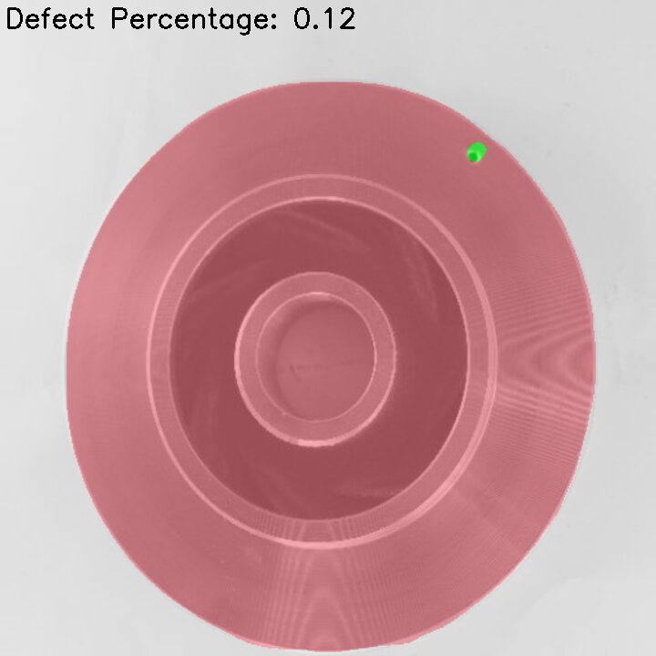

# Edge AI GStreamer Apps for Defect Detection

This repo adds support for Defect Detection on top of edgeai-gst-apps

This Repository contains two part:
1. Defect Detection Using Semantic Segmentation
2. Defect detection using Object Detection

Click On the below headings to expand.

<details >
<summary><h2 style="display:inline;cursor: pointer;">Defect Detection using Semantic Segmentation</h2></summary>


> This Github Repository adds support for **Defect Detection using semantic segmentation** Using [**EDGE-AI-Model-Maker**](https://github.com/TexasInstruments/edgeai-modelmaker) tool for TI Embedded Processor.

## Table of content
- [Supported Devices](#supported-devices)
- [Steps to run](#steps-to-run)
- [Result](#result)
- [Dataset Overview](#defect-detection-in-casting-product-image-data)
- [How to Train Your Own Model Using Model Maker](#how-to-train-your-own-model-using-model-maker)
- [Custom post-processing](#post-processing)

## Supported Devices

| **DEVICE**              | **Supported**      |
| :---:                   | :---:              |
| SK-TDA4VM               | :heavy_check_mark: |

## Steps to run:

1. Clone this repo in your target under /opt

    ```console
    root@tda4vm-sk:/opt# git clone https://github.com/TexasInstruments/edgeai-gst-apps-defect-detection.git
    root@tda4vm-sk:/opt# cd edgeai-gst-apps-human-pose
    ```

2. Download model for human pose estimation

    ```console
    root@tda4vm-sk:/opt/edgeai-gst-apps-defect-detection# ./download_models.sh -d defect_detection
    ```

3. Download sample input video

    ```console
    root@tda4vm-sk:/opt/edgeai-gst-apps-human-pose# wget --proxy off http://software-dl.ti.com/jacinto7/esd/edgeai-test-data/demo_videos/human_pose_estimation_sample.h264 -O /opt/edgeai-test-data/videos/human_pose_estimation_sample.h264
    ```

4. Run the python app

    ```console
    root@tda4vm-sk:/opt/edgeai-gst-apps-defect-detection# cd apps_python
    root@tda4vm-sk:/opt/edgeai-gst-apps-defect-detection/apps_python# ./app_edgeai.py ../configs/defect_detection.yaml
    ```

5. Compile cpp apps

    ```console
    root@tda4vm-sk:/opt/edgeai-gst-apps-defect-detection# ./scripts/compile_cpp_apps.sh
    ```

5. Run CPP app

    ```console
    root@tda4vm-sk:/opt/edgeai-gst-apps-defect-detection# cd apps_cpp
    root@tda4vm-sk:/opt/edgeai-gst-apps-defect-detection/apps_cpp# ./bin/Release/app_edgeai ../configs/defect_detection.yaml
    ```

## Result




## Defect Detection in Casting Product Image Data
The dataset is of casting manufacturing products. These are the top view of the submersible pump impeller.\
Casting is a manufacturing process in which a liquid material is usually poured into a mold, which contains a hollow cavity of the desired shape, and then allowed to solidify.\
The Dataset is taken from the **Kaggle**. [link to dataset](https://www.kaggle.com/datasets/ravirajsinh45/real-life-industrial-dataset-of-casting-product)

This project uses **Semantic segmentation** for detecting the defect.\
The pixel corresponding to the Defective area will be colored. 


# How to Train Your Own Model Using Model Maker

## 1. Setting Up Model Maker

The [edgeai-modelmaker](https://github.com/TexasInstruments/edgeai-modelmaker) is an end-to-end model development tool that contains dataset handling, model training, and compilation.\
**This is a command line tool and requires a Linux PC.**\
Go to [this repository](https://github.com/TexasInstruments/edgeai-modelmaker) to know the Edgeai-modelmaker in detail and install it on Linux PC.

:o: Note: 
1. I tried to run the model in the Virtual Box, but it didn't work for me. This needs a CUDA-enabled Linux PC to run.
2. I installed the model from the GitHub and tried to run but it didn't work for me. So I installed it from TI's BigBucket Page. [edgeai-model-maker Bitbucket](https://bitbucket.itg.ti.com/projects/EDGEAI-ALGO/repos/edgeai-modelmaker/browse). If you see the `setup_all.sh` file you will get to know that another 4 repositories are cloned to run the model-maker.  
a. edgeai-torchvision\
b. edgeai-edgeai-mmdetection\
c. edgeai-benchmark\
d. edge ai-model_zoo


:o: Note: You can clone only one branch for faster installation.

Follow each instruction in the Model-Maker Github Page to set up the Model-Maker.

## 2. Annotating Data
The annotation file must be in **COCO JSON** format.

**If you are using Label Studio take note of the following:**  

- For Semantic Segmentation we can export data in COCO-JSON format only if we use a polygon tool to annotate data.  
- :o: Note: We can't export data in COCO JSON format if we use the brush tool for semantic segmentation annotation in Label Studio. 

**How to use label studio**

- Make an account in label-studio by signing up.
- Create a new project in Label Studio and give it a name in the "Project Name" tab.
- In the Data Import tab upload your images. (You can upload multiple times if your images are located in various folders in the source location).
- Go to Setting at the top right.
- In the tab named "Labelling Setup ->" click on "Browse Template". choose "Semantic Segmentation with Mask".
- Remove the existing "Choices" and add your Label Choices (Object Types) that you would like to annotate. Clip on Save.
- Now the "project page" is shown with the list of images and their previews.
- Now click on an image listed to go to the "Labelling" page.
- Do not forget to click "Submit" before moving on to the next image. The annotations done for an image are saved only when "Submit" is clicked.
- After annotating the required images, go back to the "project page", by clicking on the project name displayed on top. From this page, we can export the annotation.
- Export the annotation in COCO-JSON. 


### 2.a Semantic Segmentation Dataset Format
- The annotated JSON file and images must be under a suitable folder with the dataset name.
- Under the folder with the dataset name, the following folders must exist:
1. there must be an "images" folder containing the images
2. there must be an annotations folder containing the annotation JSON file with the name given below.

```
edgeai-modelmaker/data/downloads/datasets/dataset_name
                             |
                             |--images
                             |     |-- The image files should be here
                             |
                             |--annotations
                                   |--instances.json
```

Once data have been annotated, exported in COCO-JSON format, and placed the data in the above format, it's time to start the training and compilation of the model.

## 3. Training and Compilation

Make sure you have activated the Python virtual environment. By typing  `pyenv activate py36` .\
\
**Setting up the configuration file.**
- Go to the `edgeai-modelmaker/config_segmentation.yaml` to set up the configuration file.
- In the yaml file under `common` change the `target_device` name according to your device.
- Under `dataset` change the `annotation_prefix` with the name of the annotation file in `edgeai-modelmaker/data/downloads/datasets/dataset_name/annotations`. For example, if the name of your annotation file is "abcd.json". Then update `annotation_prefix:'abcd'`
- `dataset_name`: You can give any name of your choice.
- `input_data_path: ` Here give the path to the dataset. `./data/downloads/datasets/dataset_name`

- Under `training` tune the parameters.
- `num_gpu` is the number of GPUs you will be using for the training.

- Then finally under `compilation` tune the parameter according to your need. You can add `calibration_frames` and `calibration_frames` also.
```
compilation:
    # enable/disable compilation
    enable: True #False
    tensor_bits: 8 #16 #32
    calibration_frames: 10
    calibration_iterations: 10
```


After Setting up the configuration file go to the `edgeai-modelmaker` directory in the terminal and enter the following command and hit Enter.
```
./run_modelmaker.sh <target_device> config_segmentation.yaml
```

The training and compilation will take a good amount of time.

The Compiled model will be saved to `edgeai-modelmaker/data/projects/dataset_name`

## 4. Deployment on the Board
Once The compilation is completed we can deploy the compiled model on the board.

We have to copy `edgeai-modelmaker/data/projects/dataset_name/run/20230605-174227/fpn_aspp_regnetx800mf_edgeailite/compilation/TDA4VM/work/ss-8720` this folder to the board.
The content of this file is shown in the below picture.


### 4.a Connecting Board to PC using UART
1. Install the [MobaXterm](https://mobaxterm.mobatek.net/download.html) to the PC to remotely connect to the Board.
2. Once installed connect the board to the PC through the UART cable. 
3. Open MobaXterm and Click on the session.
4. Click on the Serial and select a Port from the drop-down.
5. Baud rate should be configured to **115200** bps in the serial port communication program. 

:o: Note: If using a Windows computer, the user may need to install additional drivers for ports to show up. (https://www.silabs.com/developers/usb-to-uart-bridge-vcp-drivers).\
Click on the link. Go to Downloads. Download and install ***CP210x Windows Drivers with Serial Enumerator***.

6. Once the port is visible, Connect to all the ports and Reboot the board. 
7. The boot log will be visible in one of the ports. Other ports may be closed.
8. In the login prompt: type `root` as the user.
9. Your current directory in the terminal will be like: `/opt/edgeai-gst-apps`

### 4. b Connecting remotely using SSH
 You can also access the device with the IP address that is shown on the display. With the IP address, one can ssh directly to the board.\
 In MObaXterm:
 1. Click session
 2. Click SSH
 3. Enter the IP displayed on board
 4. Hit enter
 5. In the login prompt:  type `root` as the user.
 
One Can also use **VS code** to remotely login using SSH.

After login when You go to the `/opt` the directory structure will be like this:


`/opt/edgeai-gst-apps`  Contains the apps to run the model.\
`/opt/model_zoo` contains all the models. The downloaded model from the EDGE AI STUDIO will be saved here.\
`/opt/edgeai-test-data` contains the input data ( image, videos to run the model ).


### 4.c Copying the Downloaded model to the board

We can use the `scp` Command to copy the model from our PC to the board.
1. Open your terminal
2. Go to the directory where the Model is saved.
3. Type the following command:

```
scp -r model_folder_name root@ip_address_of_board:/opt/model_zoo
```
Note: ip_address_of_board will be shown on the monitor when you will start the board after connecting to all peripherals.


## 5. Testing on the board

### 5.a  Importing data on the board for testing
Before Importing Images to the board, Rename the images file sequentially.
```0000.png , 0001.png ,0002.png ......... 000n.png```
It will help in a slide showing images on the screen.

To copy the data to the board `scp` command can be used again.
1. Go to the folder where the image folder is located.
2. Type the below command.
`scp -r image_folder_name root@ip_address_of_device:/opt/edgeai-test-data`
3. Hit enter
4. All the images files will be copied to `opt/edgeai-test-data/image_folder_name`


### 5.b Making the Configuration file
The next task is to make a Configuration file for the project. 
The config folder is located at `opt/edgeai-gst-apps/configs`
(You can make a copy of the existing `.yaml` file and edit it or else you can write a new `.yaml` file.)

**Component of config file**

```
title: "Defect Detection Using Semantic Segmentation"
log_level: 2
inputs:
    input0:
        source: /dev/video2
        format: jpeg
        width: 1280
        height: 720
        framerate: 30
    input1:
        source: /opt/edgeai-test-data/videos/video_0000_h264.h264
        format: h264
        width: 1280
        height: 720
        framerate: 30
        loop: True
    input2:
        source: /opt/edgeai-test-data/Mask_dataset/%04d.png
        width: 1280
        height: 720
        index: 0
        framerate: 1
        loop: True
models:
    model0:
        model_path: /opt/model_zoo/20230530-081846_yolox_s_lite_onnxrt_TDA4VM
        alpha: 0.4
    model1:
        model_path: /opt/model_zoo/ss-8720
        alpha: 0.4
    model2:
        model_path: /opt/model_zoo/ONR-SS-8610-deeplabv3lite-mobv2-ade20k32-512x512
        alpha: 0.4
outputs:
    output0:
        sink: kmssink
        width: 1920
        height: 1080
        overlay-performance: True
    output1:
        sink: /opt/edgeai-test-data/output/output_video.mkv
        width: 1920
        height: 1080
    output2:
        sink: /opt/edgeai-test-data/output/output_image_%04d.jpg
        width: 1920
        height: 1080

flows:
    flow0: [input2,model0,output0,[320,180,1280,720]]
```

1. inputs :  
This includes all the input sources.\
We can have multiple inputs: input 0, input 1 ....... input n.\
             `source: /dev/video2` is for the camera connected to the board.\
             `source: /opt/edgeai-test-data/videos/video_0000_h264.h264` is for the video dataset saved at the given location.\
             `source: /opt/edgeai-test-data/Casting_defect_dataset/%04d.png` is for the images at the `/opt/edgeai-test-data/Casting_defect_dataset`. Note that the images will go one by one for input as a slide show.

2. models :   
Like inputs, we can have different models. The path of the model in model_zoo needs to be specified here.

3. outputs:  
In this section, the output path is specified.\
`kmssink` correspond to the Monitor connected to the board.\
We can also save the results as video or image files by specifying their path.

4. flows :  
In flow, we specify the combination of the input source, model name, and output destination.  
For example:  
`flow0: [input2,model0,output0,[320,180,1280,720]]`  
This means use input 2, model 0, and output 0 to run.    
[320,180,1280,720]  
In this, the first number and second number is for X and Y coordinate respectively from where we want to display the result on the monitor.  
The Third number shows the length of the result to be shown along the X axis.  
The Fourth number shows the length of the result to be shown along the Y axis.  

 
:o: Note that we can write many flows using different combinations of input, model, and output. And we can see multiple outputs on the monitor.


## 6. Running the Model on the Board
Once You have done below three things:
1. Copied model to the board
2. Copied dataset to the Board
3. Added Config file

The Model is ready to run.
We can run the model using python-apps or CPP apps.
To run the Model with Python apps:
1. Go to `/opt/edgeai-gst-apps/apps_python`
2. Type `./app_edgeai.py ../configs/config_file_name.yaml` in Terminal and hit Enter.


##  Custom Post-Processing
 
 The result of the model will be an image with coloured defective pixel.
 In this Post processing, We will calculate the percentage defect in the "submersible pump impeller" For that calculate the area of defective region, and non defective region. The resultant mask from the model will categories each pixel to one of the three class defective pixel, pump, and background. \

Percentage defect = [defective area / ( defective area + non defective area )] * 100

So for this count the pixel of the defective area and non-defective area.

Post-processing in Python is located at: `opt/edgeai-gst-apps/apps_python/post_process.py`

```
class PostProcessSegmentation(PostProcess):
    def __call__(self, img, results):
        """
        Post process function for segmentation
        Args:
            img: Input frame
            results: output of inference
        """
        img = self.blend_segmentation_mask(img, results[0])

        return img

    def blend_segmentation_mask(self, frame, results):
        """
        Process the result of the semantic segmentation model and return
        an image color blended with the mask representing different color
        for each class

        Args:
            frame (numpy array): Input image in BGR format which should be blended
            results (numpy array): Results of the model run
        """

        mask = np.squeeze(results)
        
        if len(mask.shape) > 2:
            mask = mask[0]

        if self.debug:
            self.debug_str += str(mask.flatten()) + "\n"
            self.debug.log(self.debug_str)
            self.debug_str = ""

        # Resize the mask to the original image for blending
        org_image_rgb = frame
        org_width = frame.shape[1]
        org_height = frame.shape[0]
        
        # 1 in mask corresponds to defective pixel
        # 0 in mask corresponds to Non defective pixel ( PUMP )
        # 2 in mask corresponds to background 
        
        # Count number of pixel of each label 
        num_defect=np.count_nonzero(mask == 1)
        num_pump=np.count_nonzero(mask==0)
        num_background=np.count_nonzero(mask==2)
        
        # Calculating Percentage Defect
        defect_percentage=round(((num_defect*100)/(num_defect+num_pump)),2)
        
        
        mask_image_rgb = self.gen_segment_mask(mask)
        
        mask_image_rgb = cv2.resize(
            mask_image_rgb, (org_width, org_height), interpolation=cv2.INTER_LINEAR
        )

        blend_image = cv2.addWeighted(
            mask_image_rgb, 1 - self.model.alpha, org_image_rgb, self.model.alpha, 0
        )
        
        # Adding Text "Defect Percentage" On the result with the use of putText in open CV
        cv2.putText(
            blend_image,
            "defect_percentage :"+str(defect_percentage),
            (5, 30),
            cv2.FONT_HERSHEY_SIMPLEX,
            1.0,
            (0, 0, 0),2,
        )
        
        return blend_image

    def gen_segment_mask(self, inp):
        """
        Generate the segmentation mask from the result of semantic segmentation
        model. Creates an RGB image with different colors for each class.

        Args:
            inp (numpy array): Result of the model run
        """
        
        # 1 in mask corresponds to defective pixel
        # 0 in mask corresponds to Non defective pixel ( PUMP )
        # 2 in mask corresponds to background
        
        
        # random color assignment based on class-id's
        # Class_id 1 corresponds to defect lets color these pixel with green (10,255,30) color.
        # coloring background (Class_id=2) with (220,220,220)
        # coloring pump (Class_id=0) with (255,128,128)
        
        r_map=np.copy(inp)
        r_map[r_map==0]=255
        r_map[r_map==1]=10
        r_map[r_map==2]=220
        
        g_map=np.copy(inp)
        g_map[g_map==1]=255
        g_map[g_map==0]=128
        g_map[g_map==2]=220
        
        b_map=np.copy(inp)
        b_map[b_map==2]=220
        b_map[b_map==0]=128
        b_map[b_map==1]=30
        
        
        return cv2.merge((r_map, g_map, b_map))
```

- The number of defective and non-defective pixels in the mask can be counted by `np.count_nonzero`.

- CV2.rectangle and CV2.putText functions can be used to put text on the image.

- The color of the segmentation can be changed in `gen_segment_mask` function. The pixel corresponding to the defect and pump and background can be changed to some other value to change the color of the mask.

- After generating the rgb segmentation mask it is blended with the real image.


### <ins>Basic summary of the code changes</ins>
* **apps_python**: Modified `PostProcessSegmentation Class` in post_process.py .
* **apps_cpp**:  Modified "post_process_image_segmentation.cpp" at `apps_cpp\common\src\post_process_image_segmentation.cpp`
* **configs**:  Added a new config file "defect_detection.yaml"

**The code changes done to add post-processing logic for Calculating Percentage defect can be found in this** [commit](https://github.com/saurabh260120/edgeai-gst-apps-defect-detection/commit/59126d5776e08a354c2f30f94df8ecb8d4aa8735).

</details>

***

<details><summary><h2 style="display:inline;cursor: pointer;" >Defect Detection Using Object Detection</h2></summary>

> This Github Repository adds support for **Surface Crack Detection** Using [EDGE-AI-STUDIO](https://www.ti.com/tool/EDGE-AI-STUDIO) Model Composer  for TI Embedded Processor.

## Table of content
- [Supported Devices](#supported-target-devices)
- [Steps to run](#steps-to-run-on-target-device)
- [Result](#results)
- [Dataset Overview](#surface-crack-dataset-overview)
- [How to Train Your Own Model Using EDGEAI-STUDIO](#how-to-train-your-own-model-using-edgeai-studio)
- [Custom post-processing](#custom-post-processing)
## Supported Target Devices

| **DEVICE**              | **Supported**      |
| :---:                   | :---:              |
| SK-TDA4VM               | :heavy_check_mark: |

## Steps To Run on Target Device

1. Clone this repo in your target under /opt

    ```console
    root@tda4vm-sk:/opt# git clone https://github.com/TexasInstruments/edgeai-gst-apps-defect-detection.git
    root@tda4vm-sk:/opt# cd edgeai-gst-apps-defect-detection
    ```

2. Download model for Surface Crack detection

    ```console
    root@tda4vm-sk:/opt/edgeai-gst-apps-defect-detection# ./download_models.sh -d defect_detection
    ```

3. Download sample input video

    ```console
    root@tda4vm-sk:/opt/edgeai-gst-apps-human-pose# wget --proxy off http://software-dl.ti.com/jacinto7/esd/edgeai-test-data/demo_videos/human_pose_estimation_sample.h264 -O /opt/edgeai-test-data/videos/human_pose_estimation_sample.h264
    ```

4. Run the python app

    ```console
    root@tda4vm-sk:/opt/edgeai-gst-apps-defect-detection# cd apps_python
    root@tda4vm-sk:/opt/edgeai-gst-apps-defect-detection/apps_python# ./app_edgeai.py ../configs/surface_defect_detection.yaml
    ```

5. Compile cpp apps

    ```console
    root@tda4vm-sk:/opt/edgeai-gst-apps-defect-detection# ./scripts/compile_cpp_apps.sh
    ```

5. Run CPP app

    ```console
    root@tda4vm-sk:/opt/edgeai-gst-apps-defect-detection# cd apps_cpp
    root@tda4vm-sk:/opt/edgeai-gst-apps-defect-detection/apps_cpp# ./bin/Release/app_edgeai ../configs/surface_defect_detection.yaml
    ```

## Results


## Surface Crack dataset Overview
Concrete surface cracks are major defect in civil structures. Crack detection plays a major role in the building inspection, finding the cracks and determining the building health.

This Project uses Object detection in **Edge AI Studio** to train and compile the model.

# How to Train Your Own Model Using EDGEAI-STUDIO

## 1. Understanding and Connecting target Devices
A Link of Detailed Documentation of the Devices are given below:
1. TDA4VM : (https://software-dl.ti.com/jacinto7/esd/processor-sdk-linux-edgeai/TDA4VM/08_06_00/exports/docs/common/sdk_overview.html)
2. AM62A  : (https://software-dl.ti.com/jacinto7/esd/processor-sdk-linux-edgeai/AM62AX/08_06_00/exports/docs/common/sdk_overview.html)
3. AM68A  : (https://software-dl.ti.com/jacinto7/esd/processor-sdk-linux-edgeai/AM68A/08_06_00/exports/docs/common/sdk_overview.html)

The above documents tells in details how to start the board, and run the sample apps on that.

## 2. Edge AI Studio Model Composer
The [Edge AI studio model composer](https://dev.ti.com/modelcomposer/) train , optimize and Compile the AI model for TI Embedded Processor. 
Currently, the Edge AI Studio can compose Object detection and Image Classification Task.

Below are the steps to use Edge AI Studio Model Composer

### 2.1. Creating the project
1. Click on create new project.
2. From task type Drop Down menu select "Object detection" or "Image Classification" based on the task.
3. Write name of project
4. Click Start Composing

### 2.2. Dataset Preparation
Data can taken from various input sources. Click on the Input Source.
1. **PC Camera:** The Images can directly be taken using Inbuilt PC camera. Click on the PC Camera and select a Camera from the available Camera list, Select the image format from "JPG" and "PNG".
2. **Device Camera:**
3. **Import Images from Local PC:** Existing datasets can be imported directly in JPG, PNG format. Click onImport Images from Local PC. Select a folder from the local PC. On the right panel select the images and click Confirm.  
4. **Import Annotated Archive dataset:** Annotated archive data can also be imported.

:o: *Note that the data annotated outside the edgeAI Studio can not be imported. Only the data which are annotated and Downloaded from edge AI studio, that can be uploaded.*

### 2.3. Data Annotations
Once dataset is imported, data annotation can be done.

**Steps for annotating For Object Detection:**
1. Select a image from the left panel.
2. Click on the Square like shape left to the image.
3. Drag on the image where Box is to be drawn.
4. Fill / Select the label in pop up.
5. Repeat for All the images.
Note: Image can be zoomed , dragged aside also. Try all the icons left to the image.

**Steps for annotating For Object Detection:**
1. In classification first add all the label.
2. Click on the '+' icon on the top right.
3.  In the Pop Up window, Click on the + icon on the bottom left.
4.  Enter the label name and hit enter.
5.  Now select image from the left panel and select the label from right panel.
6.  Repeat for all the images.

Once Done with the annotations, the annotated data can be downloaded by clicking on Download symbol above the left panel.
It is recommended to Download the Annotated Data, incase by mistake project got deleted.


### 2.4. Model Selection
Once all the data is annotated, move to the next section.\
**Device Selection:** Select the Target device. Drag the slider to find the best trade-off between power and performance for your task.\
**Model Selection:**  Select a model according to the need "faster accuracy" or "faster Performance"

### 2.5. Train
Tune the training Parameter According to need. And Click on the start training button on the top-right.
The training Performance will be Shown as shown in below image.


Once the model is trained go to the next Section Compilation.


### 2.6. Compilation
In Compilation Section, Choose the compilation parameters from the drop down.
If accuracy is not priority and only you need to compile to see the result select the "Best Speed Preset". 
After that Hit Start Compiling.
It will take some good amount of time.

After Compilation is over, the screen will be something like below image.


Click on **Download the Artifact to PC** to Download the Compiled model on the Local PC.

:o: Note: Download the model to your PC before closing the browser. It will not be available when you log in again if you do not download it first.

The Downloaded model will look like this:


### 2.7. Live Preview


## 3. Deployment on Board
Model can be Deployed on the board in two ways:
1. Connect the board and click Deploy model on board.
2. Manually Copying the Model on the board.

### 3.1Connecting Board to PC using UART
1. Install the [MobaXterm](https://mobaxterm.mobatek.net/download.html) to the PC to remotely connect to the Board.
2. Once installed connect the board to the PC through the UART cable. 
3. Open MobaXterm and Click on session.
4. Click on the Serial and select a Port from the drop down.
5. Baud rate should be configured to **115200** bps in serial port communication program. 

:o: Note: If using a Windows computer, the user may need to install additional drivers for ports to show up. (https://www.silabs.com/developers/usb-to-uart-bridge-vcp-drivers).\
Click on the link. Go to Downloads. Download and install ***CP210x Windows Drivers with Serial Enumerator***.

6. Once the port are visible, Connect to all the ports and Reboot the board. 
7. The boot log will be visible in one of the ports. Other ports may be closed.
8. In login prompt : type `root` as user.
9. Your current directory in terminal will be like: `/opt/edgeai-gst-apps`

### 3.2 Connecting remotely using SSH
 You can also access the device with the IP address that is shown on the display. With the IP address one can ssh directly to the board.\
 In MObaXterm:
 1. Click session
 2. Click SSH
 3. Enter the IP displayed at board
 4. Hit enter
 5. In the login prompt:  type `root` as user.
 
One Can also use **VS code** to remotely login using SSH.

After login when You go to the `/opt` the directory structure will be like this:


`/opt/edgeai-gst-apps`  Contains the apps to run the model.\
`/opt/model_zoo` contains all the model. The downloaded model from the EDGE AI STUDIO will be saved here.\
`/opt/edgeai-test-data` contains the input data ( image , videos to run the model ).


**Copying Downloaded model to the board**

We can use `scp` Command to copy the model from our PC to the board.
1. Open your terminal
2. Go to the directory where Model is saved.
3. Type the following command:

```scp -r model_folder_name root@ip_address_of_board:/opt/model_zoo```


## 4. Testing on the board


### 4.1. Importing data on the board
Before Importing Images to the board, Rename the images file sequentially.
```0000.png , 0001.png ,0002.png ......... 000n.png```
It will help in slide showing images on the screen.

To copy the data to the board `scp` command can be used again.
1. Go to the folder where image folder is located.
2. Type the below command.
`scp -r image_folder_name root@ip_address_of_device:/opt/edgeai-test-data`
3. Hit enter
4. All the images files will be copied to `opt/edgeai-test-data/image_folder_name`


### 4.2. Making Configuration file
Next task is to make Configuration file for the project. 
The config folder is located at `opt/edgeai-gst-apps/configs`
(You can make a copy of the existing `.yaml` file and edit it or else you can make a new `.yaml` file.)

**Component of config file**

```
title: "Surface Crack Detection"
log_level: 2
inputs:
    input0:
        source: /dev/video2
        format: jpeg
        width: 1280
        height: 720
        framerate: 30
    input1:
        source: /opt/edgeai-test-data/videos/video_0000_h264.h264
        format: h264
        width: 1280
        height: 720
        framerate: 30
        loop: True
    input2:
        source: /opt/edgeai-test-data/Surface_Crack_Dataset/%04d.jpg
        width: 1280
        height: 720
        index: 0
        framerate: 1
        loop: False
models:
    model0:
        model_path: /opt/model_zoo/DD_surface_crack_yolox_s_lite_onnxrt_TDA4VM
        alpha: 0.4
    model1:
        model_path: /opt/model_zoo/ss-8720
        alpha: 0.4
    model2:
        model_path: /opt/model_zoo/ONR-SS-8610-deeplabv3lite-mobv2-ade20k32-512x512
        alpha: 0.4
outputs:
    output0:
        sink: kmssink
        width: 1920
        height: 1080
        overlay-performance: True
    output1:
        sink: /opt/edgeai-test-data/output/output_video1.mp4
        width: 1920
        height: 1080
    output2:
        sink: /opt/edgeai-test-data/output/output_image_%04d.jpg
        width: 720
        height: 720

flows:
    flow0: [input2,model0,output2]
```

1. inputs :  
This include all the input sources.\
We can have multiple input : input 0,input 1 ....... input n.\
             `source: /dev/video2` is for the camera connected to te board.\
             `source: /opt/edgeai-test-data/videos/video_0000_h264.h264` is for the video dataset saved at the given location.\
             `source: /opt/edgeai-test-data/Mask_dataset/%04d.png` is for the images at the`/opt/edgeai-test-data/Mask_dataset` . Note that the images will go one by one for input as slide show.

2. models :   
Like inputs we can have different model. Path of the model in model_zoo needs to be specified here.

3. outputs:  
In this section, output path is specified.\
`kmssink` correspond to the Monitor connected to the board.\
We can also save the results as video or images files by specifying their path.

4. flows :  
In flow we specify the combination of input source ,model name and outputs destination.  
For example:  
`flow0: [input2,model0,output0,[320,180,1280,720]]`  
This means use input 2, model 0, and output 0 to run.    
[320,180,1280,720]  
In this the first number and second number is for X and Y coordinate respectively from where we want to display the result on the monitor.  
The Third number shows the length of result to be shown along X axis .  
The Fourth number shows the length of result to be shown along Y axis .  


:o: Note that we can write many flows using different combination of input , model and output. And we can see multiple output on the monitor. 


## 5. Running the Model
Once You have done below three things:
1. Copied model to the board
2. Copied dataset to the Board
3. Added Config file

The Model is ready to run.
We can run the model using python-apps or CPP apps.
To run the Model with python apps:
1. Go to `/opt/edgeai-gst-apps/apps_python`
2. Type `./app_edgeai.py ../configs/config_file_name.yaml` in Terminal and hit Enter.

</details>